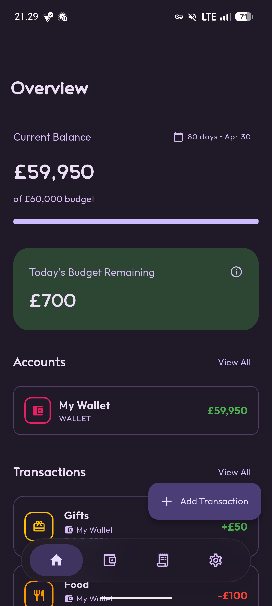
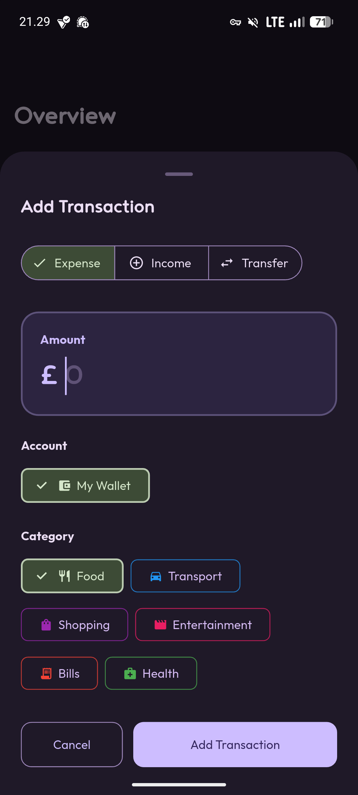
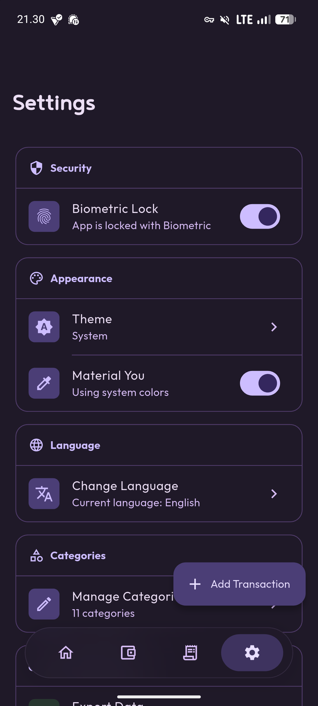

[](https://github.com/alfahrelrifananda/wallet/releases)
[](https://flutter.dev)
[](LICENSE)

# Wallet

A simple budget management app built with Flutter. Track your spending and manage your finances.

[](https://github.com/alfahrelrifananda/wallet/releases)

## Features

- Add and categorize income and expenses
- View transaction history
- Material Design 3 interface
- Your data stays on your device
- Available in English and Indonesian

## Screenshots

<div style="display: flex; justify-content: space-around; gap: 10px;">
  
  
  
</div>

## Tech Stack

- **Language:** Dart
- **Framework:** Flutter
- **UI:** Material Design 3
- **Platform:** Android (API 24+)
- **Target SDK:** API 36

## Getting Started

### Prerequisites

- [Flutter SDK](https://flutter.dev/docs/get-started/install) (latest stable version)
- Android Studio or VS Code with Flutter extensions
- Android device or emulator (API 24+)

### Installation

1. Clone the repository:
   ```bash
   git clone https://github.com/alfahrelrifananda/wallet.git
   cd wallet
   ```

2. Install dependencies:
   ```bash
   flutter pub get
   ```

3. Run the app:
   ```bash
   flutter run
   ```

## Contributing

If you'd like to contribute:
- Fork the project
- Open issues for bugs or feature requests
- Submit pull requests
- Help with translations

## License

This project is licensed under the **GNU General Public License v3.0**. See the [LICENSE](LICENSE) file for details.
